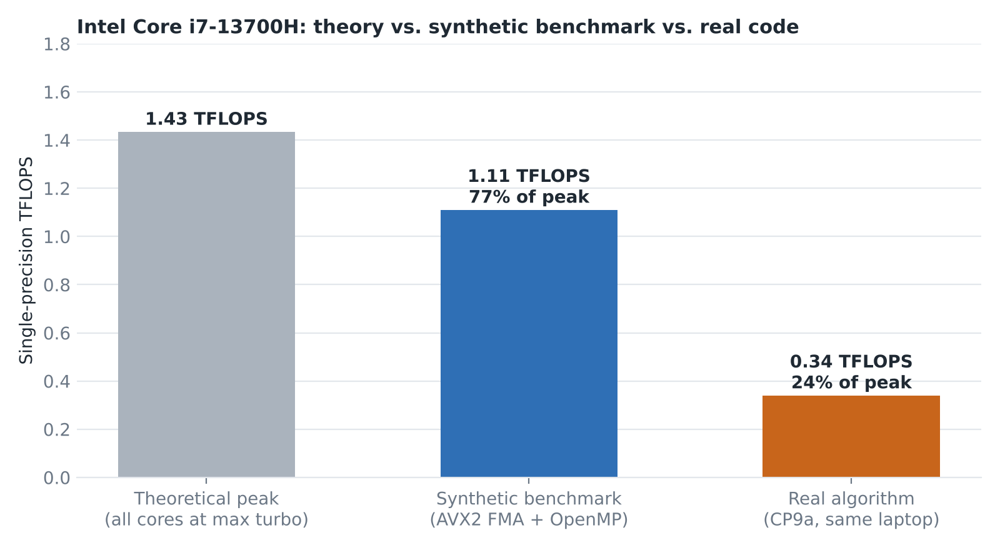
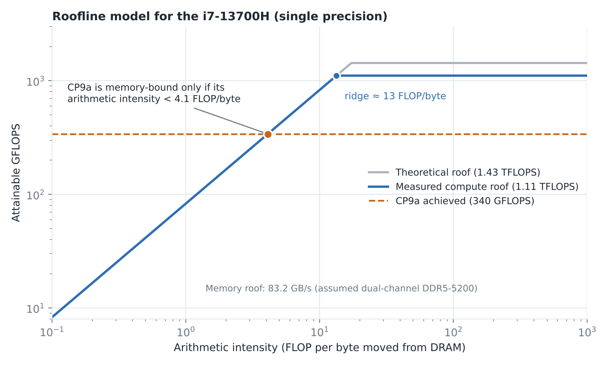

# Parallel Computing Performance Analysis

Final research project for the Programming Parallel Computers course at Aalto, on the floating-point limits of a laptop CPU. It asks how many single-precision floating-point operations per second an Intel Core i7-13700H can do in theory, how close a hand-written C++ program gets to that number, and where a real algorithm from the course ends up. The written report is `report.pdf`.

## Results



| | TFLOPS | Share of theoretical peak |
|---|---|---|
| Theoretical CPU peak | 1.43 | 100% |
| Synthetic benchmark, AVX2 FMA with OpenMP on 20 threads | 1.11 | 77% |
| CP9a, correlation matrix of 9000 vectors | 0.34 | 24% |

CP9a also ran on the course's grading server and finished in 1.435 s, about 0.51 TFLOPS. That is different hardware, so it is left out of the chart.

## Hardware

| | |
|---|---|
| CPU | Intel Core i7-13700H (Raptor Lake), 6 P-cores and 8 E-cores, 20 threads, 2.4 GHz base, up to 5.0 GHz on P-cores and 3.7 GHz on E-cores |
| GPU | NVIDIA GeForce RTX 4060 Laptop (Ada Lovelace), 3072 CUDA cores, 8 GB GDDR6 |
| OS | Windows Subsystem for Linux (Ubuntu), GCC |

The GPU is only covered in the theoretical part. I did not benchmark it.

## Theoretical peak

Peak is cores × clock × FLOPs per cycle. A P-core with AVX2 can issue two 256-bit FMA instructions per cycle, each doing 8 multiply-adds, which is 32 FLOPs per cycle. An E-core does 16.

```
CPU  6 × 5.0 GHz × 32 + 8 × 3.7 GHz × 16 = 1.43 TFLOPS
GPU  3072 × 2.37 GHz × 2                 = 14.56 TFLOPS
```

The CPU number assumes every core runs at its maximum turbo clock at the same moment, so it is an upper bound that a laptop will not hold. The sources for the core counts, clocks and FMA throughput are in `source_materials/` and in the reference list of the report.

## Benchmark

`part_b/benchmark.cc` is a synthetic program that does nothing except fused multiply-adds.

- Each thread keeps 12 independent `_mm256_fmadd_ps` chains in registers. One FMA has a latency of several cycles and the core can start two per cycle, so a single chain would leave the FMA ports mostly idle.
- The number of operations is known exactly: 1.5 × 10⁹ iterations × 12 FMAs × 16 FLOPs × 20 threads = 5.76 × 10¹² FLOPs.
- OpenMP runs it on all 20 hardware threads. The start values depend on the input, and the partial results are summed and used, so the compiler cannot remove the work.
- Time is wall-clock time from `std::chrono`. A run takes about 5 seconds.

It reaches 1.11 TFLOPS. The assembly (`part_b/benchmark.s`) shows that the inner loop is 12 `vfmadd132ps` instructions on `%ymm` registers plus a `subq` and a branch, with no loads or stores, so the data stays in registers.

The remaining 23% has three causes that I could identify. Under dense AVX2 load the P-cores settled between 4.37 and 4.52 GHz instead of 5.0 GHz, because of thermal and power limits (screenshots in `part_b/`). The E-cores are slower, so the P-cores wait for them at the OpenMP barrier at the end of the parallel region. And 12 of the 20 threads are hyper-threads that share the FMA ports of the 6 P-cores.

## CP9a

`part_c/cp.cc` is my fastest solution to exercise CP9a, which computes the correlation matrix of 9000 vectors with 9000 elements each. With normalised rows, each of the 40,495,500 vector pairs needs a dot product of about 18,000 floating-point operations, 7.29 × 10¹¹ in total. Counting that way makes the result an effective rate, based on the operation count of the straightforward algorithm.

On the laptop it takes 2.145 s, which is 340 GFLOPS. That is about 30% of what the synthetic benchmark reaches on the same machine.

## Roofline



In the roofline model, attainable performance is the smaller of the compute peak and memory bandwidth × arithmetic intensity (FLOPs per byte moved from DRAM). I assumed 83.2 GB/s for the memory roof, which is dual-channel DDR5-5200. I did not measure the bandwidth of this laptop, so treat the slanted part of the plot as approximate. With the measured 1.11 TFLOPS as the compute roof, the ridge point is at about 13 FLOP/byte.

The synthetic benchmark sits far to the right of the ridge and is limited by the clock and the FMA ports. On the memory roof, 340 GFLOPS corresponds to an arithmetic intensity of 4.1 FLOP/byte. If CP9a moves more than one byte from DRAM for every 4.1 FLOPs, DRAM bandwidth caps it. If it moves less, something else does, for example cache bandwidth, the load ports or loop overhead.

The report explains the gap to the benchmark with the memory hierarchy, but I did not measure CP9a's DRAM traffic, so that explanation is an inference. Two experiments would settle it: count DRAM traffic with hardware counters, or run the same kernel on an input that fits in L1 or L2 and see whether it gets close to 1.11 TFLOPS.

## Build and run

```bash
g++ -O3 -march=native -fopenmp part_b/benchmark.cc -o benchmark
./benchmark                 # asks for a float, for example 1.1

g++ -O3 -march=native -fopenmp -S part_b/benchmark.cc -o benchmark.s   # the assembly
```

It needs a CPU with AVX2 and FMA. The thread count is taken from `omp_get_max_threads()`, so the FLOP count in the output follows the machine it runs on. CP9a is built and checked by the course's grading system, so `part_c/` holds only the source and the logs.

## Repository layout

```
report.pdf          the written report: parts (a), (b) and (c) of the assignment
charts/             the two figures above
part_b/             benchmark.cc, the generated assembly, telemetry screenshots
part_c/             cp.cc (CP9a), benchmark logs from the laptop and the server
source_materials/   links to the Intel and NVIDIA documents used for the peak calculation
```
